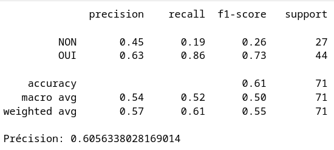
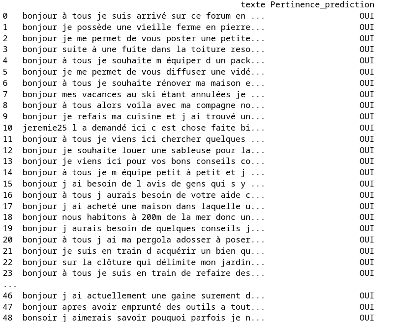

## Choix du dataset

### Semaine 1 
Choix du sujet et de la structuration des données.
Objectif : J'aimerai réaliser une tache de Question Answering puisqu’il me semble que c’est une tâche essentielle que je pourrais rencontrer plus
tard dans ma carrière en NLP. En regardant les différents corpus sur HuggingFace fournis pour cette tâche on remarque que très peu des dataset
sont réalisé sur des corpus en français. 
Ma démarche pour choisir le dataset a été un peu laborieuse. Au début j’ai voulu prendre ce dataset: 
- 1ere tentative : DILA-OPENDATA-FR-2023 : https://huggingface.co/datasets/Nicolas-BZRD/DILA_OPENDATA_FR_2023/viewer/default/acco?p=2541 
Sauf que j’ai eu du mal à comprendre comment était structuré les questions et les réponses. Je crois qu’il y’a avait un document pour la question
et un autre document pour les réponses. 
- 2eme tentative : Je suis parti sur ce dataset ensuite fourni par le même utilisateur : https://huggingface.co/datasets/Nicolas-BZRD
uld_loss_Mistral-7B-Instruct-v0.2-squad?row=25 Cela m’a permis d’identifier certaines patterns dans la structuration des datasets pour le Question
Answering. On retrouve souvent une colonne question, une autre réponse (logique) mais aussi une colonne contexte dans laquelle il faut préciser
un peu pourquoi est posé cette question. Mais j’ai surtout l’impression que la réponse ce fait en fonction des éléments donnés dans le contexte.
De plus je n’étais pas trop satisfait car le corpus était en anglais et l’auteur a très peu détaillé son travail. 
- 3eme tentative : Du coup j’ai continué à chercher et je suis tombé sur ce dataset qui prennait en compte du français : https://huggingface.co/datasets/almanach/hc3_french_ood Ce dataset a été produit par une équipe ALMAnaCH du la boratoire de l’INRIA ? Il a servi à plusieurs tâches :
une tâche de classification du texte. En effet on observe dans la dernière colonne une colonne « etiquette » qui classifie si ça été écrit par un
humain ou non. Une tâche de Questn Answering (logique c’est celle qui nous intéresse) on retrouve une colonne « question » et une colonne
« réponse » et une tâche de « Sentence Similarity ». En revanche, il n’y a pas de sous-tâche associée à ce dataset et aucun modèle ne semble
l’utiliser à ce jour. Cela peut s’expliquer de par sa récente publication moins d’un an (en Juin 2023). 
L’objectif de ce travail était de détecter si ChatGPT est facile à détecter en fonction des réponses. 
Dans la structuration des données, je remarque qu’il n’y de colonne contexte dans laquelle il était nécéssaire de préciser le contexte de la
question. La réponse semble être faite directement à partir de la page internet. Il y’a des colonnes id, page_id, answer_id, bucket et domain qui sont des identifiants qui permettent d’identifier de façon précise chaque question et réponse. 
Ensemble de données en 2 parties : • First, an extension of the Human ChatGPT Comparison Corpus (HC3) dataset with French data automatically
translated from the English source. • Second, out-of-domain and adversarial French data set have been gathereed (Human adversarial, BingGPT,
Native French ChatGPT responses). 
C’est surtout la 2eme parties qui va m’interesser pour le QA en français. « Out of modele » de ce que j’ai compris qui va m’interesser puisqu’on avec des sous ensembles de données tel que faq_fr_random et faq_fr_gouv. faq_fr_gouv la majorité des données proviennent de site .gouv (test:
235 exemples, 22336 mots) faq_fr_random est un ensemble de données récupérés sur des sites random en français contenu dans le dataset MQA
(Microsoft Question Answering), qui semble être une ressource contenant des questions et réponses sur divers sujets. 
Pour la constitution de mon corpus je n’utiliserai pas les colonnes de classification et me contrerais que sur la tache de QA. 

Je me pose cependant encore quelques questions quant à la structuration du corpus : Tout d’abord où vais-je pouvoir me proccurer ce genre de corpus « open source » qui permet de faire du question answering (sur un forum ?, mais dans ce cas là il faudra anonymiser les données) Quelles
prédictions ? la taille des question et des réponses ? 

--------------------------

## Réflexions sur le choix du corpus

### Semaine 2 
Pour une tâche de QA je me suis dis que les outils en ligne sur lesquels on en retrouvait beaucoup sont les forums.
J'ai pris un forum au hasard, il s'est avéré que je suis tombé sur un forum de bricolage.

Enfin je dis au hasard mais pas tout à fait, il fallait trouvé un forum sur lequels on obtenait des réponses claires. Car le fonctionnement d'un forum quelqu'un pose une question et plein de personnes lui réponde. Il fallait donc me servir d'un forum qui avait un myen d'identifier la meilleure réponse.
Il n'y a pas de mention et pour des raisons d'anonymat j'ai choisi de ne pas divulguer le noms des utilisateurs (en revanche surement un soucis lorsque les utilisateurs mentionnent, leur métier et où ils habitent ou même des fois signent leur post. Il faudra traiter ça).
Il n'y a pas de mentions légales sur le site pour ce qui est du scrapping donc j'en ai déduit que je pouvais scrapper ce forum.

--------------------------

## Méthodologie et constitution du corpus : 
Dans le dataset que j'ai choisi beaucoup d'informations sont indiquées, il y a notamment une colonne label qui identifie si la question a été posé par un humain où par un LLM style chatgpt. Je vais essayer de simuler ça en regardant s'il n'existe pas une bibliothèque python qui détécte si quelque chose a été écrit par chagpt. (je n'ai finalement pas trouvé)
Mon corpus est constitué de 26 (questions-réponses issues du forum) et 24 questions (issues du forum) avec des réponses de chatgpt.

Observation : Deja sans chercher d'outils pour détecter chatgpt, on remarque que les réponses de chatgpt ont toutes les même format. Elles sont très longues et très méthodique. Elles consistent en une enumération de différentes actions à faire pour résoudre le problème, suivie d'une phrase de conclusion qui résume les actions à effectuer du style (j'espere que ces idées seront utiles, en résumé...).

--------------------------

### Semaine 3
J'ai décidé de me servir de la librairie. BeautifulSoup afin de scrapper la page du forum.

Au debut j'avais fait une enorme fonction qui ouvrait les urls et en récuppait la question et la meilleurer réponse. Mais au niveau de la visibilité du code j'ai du diviser en plusieurs fonction afin de ne pas perdre le fil.

### Prétraitement des données
- J'ai récupperé les liens qui m'interessait
Il a tout d'abord fallu retirer les liens des pubs/spam qui avait la même construction avec des balises que nos questions. 
- Une fois les questions récuppérées, il a fallu retirer les liens qui pouvait être mis dans les questions. Des liens comme des redirections ou encore des images. (Il semble y avoir un problème à la question 21)
- Il a aussi fallu prétraiter le texte afin de ne pas voir les balises de retour à la ligne. Tout cela a été possible grâce à la méthode intégrer dans BeautifulSoup get.text() qui permet de ne récupérer que le texte à l'intérieur des balises.

Problème : encodage, certains caractères de question sont mals encodés je ne comprends pas pourquoi.
Solution ? utiliser un encodage utf-8 lors de la récuppération des liens ? (marche pas)

- Pour la récuppération des questions la tâche c'est avérée plus ardue. Certaines questions ne se trouvent pas sur la même page (elles sont sur un index différents, il y'a eu plusieurs réponses donc plusieurs pages sur le même topic).
Heureusement toutes les questions principales d'un sujet sont accompagné par un petit rectangle gris qui indique un lien où est la réponse la plus pertinante. J'ai donc récuppérer ce lien et l'ai associé au résultat de la meilleure réponse. 
En revanche quand la question est sur la même page. Il faut identifier un carré bleu sous la réponse qui indique que c'est la plus pertinente. Cependant certaines fois il n'y a pas de réponse jugée pertinente (comment je vais faire ?)

------------------------ 

### Ecriture des résultats
Tous mes résultats seront écrit dans un tsv qui aura la même forme que mon dataset.
Egalement afin de rendre cela exploitable j'ai crée une dataclass qui permet de réutiliser ces données si un utilisateur souhaite compléter ou repprendre ce travail.

 
-------------
## Semaine 4

### Récupération de la question 

Très simple, il a fallu reccueilir les différentes pages du forum bricolage. Tout le contenu de chaque page est contenu dans une liste. Ensuite on a plus qu'a parcourir cette liste qui contient les différentes balises des pages et de réccupérer la question à chaque fois.

### Récuppération de la meilleure réponse ?

Plus compliqué,  probleme pour trouver la meilleure réponse. J'ai réalisé que finalement la balise post_resume n'est pas identique. J'ai remarqué que ce qui différenciait la meilleure réponse des autres était un petit intitulé "VOus consulté le sujet : blabla..." qui indique que c'est la meilleure réponse. J'ai essayé plusieurs façon pour le cibler, les re, ou les méthodes intégrées finding_siblings() de BeautifulSoup, mais rien n'y fait. Il s'avère qu'après avoir redirigé le contenu du scraper beautiful soup je me suis rendu compte que jamais "Vous consultez le sujet :" apparaissait. Cela est surement dû au fait que n'est pas dans le HTML brut de la page, cette information peut être ajoutée dynamiquement avec Javascript. Dans ce cas il faut me tourner vers un scraper plus puissant comme Selenium par exemple. Selenium a vite été abandonné car il fallait télécharger un driver et cela n'a pas fonctionné. 

Autre piste : regarder le nombre de likes (- C'est cette piste qui sera gardée) 
Il y'a 2 possibilités soit la meilleure réponse se trouve sur la page, soit elle se trouve sur une page différente du forum. 
Pour prendre en compte ces 2 cas lorsqu'il y'a une meilleure réponse dans la page il y'a un encadré gris indiquant allé à la meilleure réponse (elle contient un lien). La technique est donc de récuppérer se lien de l'extraire et d'ensuite parcourir cette page avec beautifulsoup pour récupérer la réponse avec le plus de like.

Limite de cette technique = Si un commentaire à le même nombre de like que la meilleure réponse alors c'est la première occurence du commentaire qui sera gardée. 

Nouveau probleme je n'ai pas le même nombre de liens 54 liens au total sur la page et après recherche des meilleures réponses 26: Je viens de découvrir que certains sujet ne contenait pas de "meilleure réponse" il va donc falloir les exclure.
Pour ce faire j'ai mis au point une nouvelle méthode d'extraction des questions du forum.

### Nouvelle approche pour extraire les questions

Il va falloir récupérer les urls des questions dans lesquelles ont retrouve l'intitulé "cliquez pour accéder à la meilleure réponse" (qui contient l'url vers la meilleure réponse).
Pour ce faire j'ai gardé ma fonction qui extraiyait tous les liens des questions mais cette fois ci je parcours la liste dans laquelle ils sont stockés, j'ouvre chaque lien et s'ils ont cet intitulé de réponse alors je les ajoute à une nouvelle liste.

TOUT MARCHE SUPER !!!!

Il me reste un problème certaines questions du forum sont en fait des vidéos (donc en fait l'utilisateur poste une question qui est en fait une réponse en elle-même.) Il faut donc les retirer

Remplissage de la dataclass, comme je n'ai fait en sorte d'avoir que des listes j'utilise la méthode zip pour toutes les zipper entre elles, et je parcours à chaque fois et je remplis ma dataclass.

Création d'une nouvelle dataclass plutot que de faire une liste de qui contient la dataclass à chaque fois, j'ai fait une dataclass qui est directement la liste de l'ancienne dataclass

-----
### Récupération des questions et des réponses de chatgpt 

Cette partie pose problème, puisque la page est générée dynamiquement et les questions qui sont extraites de la pages sont extraites de façon aléatoire à chaque fois (cela signifie qu'elles changenet d'url) ce qui pose problème pour leur associer une réponse qui elle est prédéfinie dans un fichier texte.
Choix : ATTENTION !!! seule l'extraction des questions est automatique les réponses sont stockées dans un fichier text qui est ensuite concaténé aux questions
J'ai essayé plusieurs approches, utiliser une random seed ça n'a pas fonctionné, alors utiliser un tri de liste en fonction du numéro associé au topic
En effet les liens sont construits sous cette forme : https://www.forumconstruire.com/construire/topic-451685 , https://www.forumconstruire.com/construire/topic-393470. Ils ont un numéro il faudrait les trier en fonction de ce numéro. ça n'a pas fonctionné.
mélanger les indices de la liste avec un seed particulier, ça n'a pas marché. Malheuresement je crois que la récupération de questions devra se faire manuellement.
Dernière alternative : 
J'ai donc extrait les liens d'une page de forum les ai stockés dans un document (afin d'avoir tout le temps les mêmes liens). Avec mon script je récupère les questions des liens associés et pose les questions à chatgpt. Je récupère les questions que je stocke dans un document aussi et ensuite je mets tout en commun dans ma dataclass et écris les résultats dans mon dataset.
Ensuite je vais copier toutes ces données et les coller dans mon dataset final.

-----

### Stockage des données

Les données sont stockées dans des fichiers csv

### Modifications des données du dataset : 
Comme je n'ai pas très bien cerné ce qu'était le bucket je ne l'ai pas intégré dans mon dataset. NB : Le bucket est exclusivement réserver au monde de l'entreprise, il s'agit de paquets de données que reçoit la société. J'ai aussi fait le choix de retirer la colonne domaine, inutile puisque je suis toujours sur la même domaine (forum bricolage), pour la remplacer par le sujet de la question que j'ai jugé plus pertinent. 
Il a donc fallu récupérer le sujet/titre de chaque question.

-----
## Semaine 5
### Evaluation de la pertinence des questions

- Évaluer la qualité des réponses ? Comment faire ?

Il se trouve que pour évaluer la pertinence de mes réponses ils auraient fallu faire des stats mais pour être honnête je n'ai aucune idée de comment m'y prendre. J'aurais pu faire par exemple (tokenizer avec spacy les questions et les réponses et faire un graphique sur la longueur des questions et la longueurs des réponses et ensuite faire un graphique pour voir si y'a yne corrélation entre les 2), mais cela n'aurait pas permis d'évaluer la pertinence des réponses ou non.

#### Réalisation / création des données pour le SVM
Mon idée a donc été de concevoir un classifieur binaire, SVM et de lui donner beaucoup de questions et de réponses (on sait qu'il faut plus de 100 objets par classes pour avoir un classifieur correct).
J'ai donc réalisé un script "creation_donnes_pour_SVM", dans ce script je récuppère une question et une réponse random du forum lui est associée. On lui appose l'étiquette de pertinence NON. On refait le même procédé cette fois-ci en récuppérant la question et la bonne réponse et on etiquetant que la pertinence est OUI.

#### Entrainement du modèle
Pour entrainer le modèle, j'ai réalisé un jupyternotebook, vous pourrez y suivre toutes les étapes sont commentées dedans. Les principales difficultés que j'ai pu rencontrer se trouve dans le prétraitement des données. En effet, j'obtenais des erreurs de typage celon laquelle panda ne pouvait pas pretraiter des float. J'ai donc du utiliser sa méthode astype pour tout convertir en str. Egalement il a fallu réfléchir à comment réaliser mes vecteurs la façon qui m'a semblé la plus logique était de concaténer ma réponse et ma question afin qu'elle ne forme plus qu'un. Ainsi on entraine notre modele sur cette concaténation et sa pertinence.
J'ai pu évaluer les mesures de précisions de mon SVM et ces dernières ne sont pas convainquantes :

#### Résultats de l'application de mon SVM sur mon dataset
Je m'attendais à obtenir des réponses non pertinente pour les réponses de chagpt mais sur mon dataset toutes les réponses sont notés pertinentes par mon svm. J'ai pu tester mon SVM en lui donnant des questions que j'ai écrite moi même et lui donner écrire des réponses qui n'ont rien à voir et malheureusement il m'étiquettait quand même que la pertinence était OUI. Cela rejoins la matrice de confusion qui démontre que notre modèle à beaucoup de mal a identifié les pertinence NON. Donc malheureusement je ne suis pas en mesure d'assurer la fiabilité de la pertinence d'une réponse pour ma tache de Question Answering

-------------
## Semaine 6
### Découpage du corpus en train dev test et écriture des résultats
Un script très simple a été conçu pour faire se découpage "train_test_dev.py" dans lequel en plus de découper mon dataset, j'écris le découpage train dev test dans des tsv différents. Le seul problème est pour que des raisons que j'ignore certaines questions se répètent.

### Création du dataset card
Je parlais beaucoup dans le README.md en expliquant en quoi consistait mon projet. Au final, j'ai tout supprimé pour faire un dataset card convenable. Je me suis appuyer sur un style de dataset card que j'ai pu trouvé sur huggingface et m'en suis servi comme modèle. 

-----------
### CONCLUSION : Limites de mon approche/ choses à améliorer / autocritique

- Récupération de la meilleure réponse : L'algorithme ne récuppère pas toujours la bonne réponse mais récuppère la 1ere question qui a le plus de like. Seulement, si 2 questions ont le même nombre de like cela gardera la 1ere même si celle là n'est pas la réponse la plus pertinente.

- Finalement lorsque j'ai entrainé mon modele j'ai récupérer beaucoup plus de questions et de réponses. On peut se poser la question de alors pourquoi mon dataset à si peu de données. Et bien pour rappel c'est uniquement puisque je voulais aussi avoir un nombre de question et réponses faite par chatgpt assez proche. Or je n'ai pas trouvé de moyen de réccupérer avec des requetes ces réponses. Donc si je voulais beaucoup de réponses cela aurait été très fastidieu.

- La signature de certains commentaires : je n'ai pas réussi à ne pas la prendre en compte (on peut retrouver parfois écrit par Jeremie25 ou Eliott32 a répondu)

- L'id d'identification des réponses : pas convaincu que cela soit réelement utile avec ma méthode.

- L'evaluation de mon SVM qui évalue la pertinence d'une réponse, ne semble pas complètement au point (la précision n'est pas bonne environ 60%)

- L'utilisation répétitive de listes : à chaque fois mes données sont stockées dans des listes et je ne suis pas certains que ce soit la meilleure chose. Certaines choses auraient pû être optimiser afin d'éviter les redites et le stockage constant dans des listes. 

- L'organisation et l'optimisation du code certaines fonctions font des fois la même chose alors que j'aurais pu lse unifier pour tout faire en une fois (ex : récupération question et récupération sujet)
